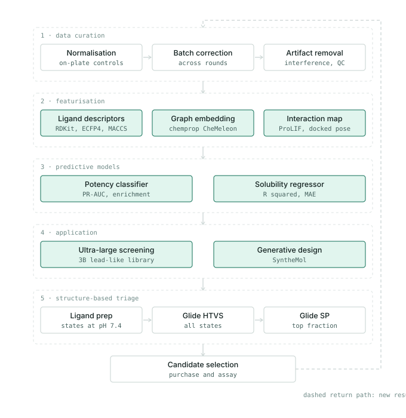

# Novel Ligand Discovery for the Bicarbonate Transporter NBCn2 Using Machine Learning, Ultra-Large Screening and Generative Design

Poster | Paper | Data Repository | Code Repository

Python package: `qsar-hit-screen`

Data curation, three feature representations benchmarked under one scaffold-disjoint
protocol, and deployment to ultra-large library screening, generative design and
structure-based triage. Target: NBCn2 (`SLC4A10`).

Trained on a 163-compound transport assay (normalised inhibition, pH-based fluorescent
readout) from an iterative structure-based campaign against a single target conformation.
The 163 compounds span 111 Murcko scaffolds.

## Workflow overview



Stages 1–3 are implemented in this package. Stages 4–5 run on an LSF cluster against
licensed third-party tools; `lsf/` holds submission templates for them, with
site-specific paths, queues and cut-offs left as placeholders.

## Contents

- [1 · Data curation](#1--data-curation)
- [2 · Featurisation](#2--featurisation)
- [3 · Predictive models](#3--predictive-models)
- [4 · Application](#4--application)
- [5 · Structure-based triage](#5--structure-based-triage)
- [Install](#install)
- [Quick start](#quick-start)
- [Input format](#input-format)
- [Repository layout](#repository-layout)
- [Citation and licence](#citation-and-licence)

## 1 · Data curation

`load_assay` reads a raw assay export and returns the QC'd modelling set:

- **Normalisation** against on-plate controls, with the vehicle control as 100 % activity
  remaining.
- **Batch grouping** — `notes` / `series` / `batch` columns are carried through so assay
  round can be used as a grouping variable.
- **Artifact and structure QC** — invalid structures dropped, SMILES canonicalised,
  duplicates resolved.

The curated endpoint is a normalised inhibition value and a binary active call at a
stated threshold (`ACTIVITY_THRESHOLD = 65.0`, adjustable).

## 2 · Featurisation

| Representation | Source | Input | Needs a pose |
|---|---|---|---|
| 2D descriptors | RDKit | SMILES | no |
| ECFP4 fingerprint | RDKit | SMILES | no |
| MACCS keys | RDKit | SMILES | no |
| CheMeleon frozen embedding (2048-d) | [chemprop](https://github.com/chemprop/chemprop) | SMILES | no |
| Protein-ligand interaction fingerprint | [ProLIF](https://github.com/chemosim-lab/ProLIF) | docked complex | yes |

```bash
python scripts/generate_embeddings.py --data data/example/assay_example.csv --out emb.npy
```

Interaction fingerprints are produced from docked poses with
`qsar_screen.structural.generate_prolif_fingerprints(protein_pdb, poses_sdf, out_csv)`
and passed to the benchmark with `--prolif-csv`.

## 3 · Predictive models

Potency is modelled as binary classification. Each feature set is paired with each
model and all pairs are evaluated under the same split.

| Features | Models |
|---|---|
| RDKit 2D descriptors | random forest |
| ECFP4, MACCS | support vector machine |
| CheMeleon embeddings | XGBoost |
| ProLIF interaction fingerprints | |

### Evaluation

```python
StratifiedGroupKFold(n_splits=5, shuffle=True, random_state=42)
groups = Murcko scaffold of each compound
```

| Task | Metrics |
|---|---|
| potency, classification | PR-AUC, enrichment factor (top 10 %) |
| solubility, regression | R², MAE |

A label-permutation test is available via `--permutations N` to establish the null.

```bash
python scripts/train.py      --data data/example/assay_example.csv
python scripts/benchmark.py  --data data/example/assay_example.csv --out benchmark.csv
python scripts/learning_curve.py --data data/example/assay_example.csv
```

## 4 · Application

Submission templates in `lsf/`; paths and cut-offs are placeholders.

- **Ultra-large library screening** — the trained potency and solubility models are
  applied to a 3-billion-compound lead-like subset of
  [Enamine REAL](https://enamine.net/compound-collections/real-compounds), as an LSF
  array job with one task per library shard.
- **Generative design** — de novo candidates are generated with
  [SyntheMol](https://github.com/swansonk14/SyntheMol), which composes Enamine REAL and
  WuXi GalaXi building blocks under validated reaction templates, using the trained
  models as the reward.

```bash
bsub < lsf/screen_library.lsf        # one array task per library shard
bsub < lsf/generate_synthemol.lsf    # one array task per RNG seed
```

## 5 · Structure-based triage

Docking enters last and for one specific reason: it rejects geometrically unreasonable
poses, which is information no ligand-based model contains.

Candidates are prepared into protonation and tautomer states at pH 7.4, docked with
Glide HTVS, and the top fraction re-docked with Glide SP.

Ligand preparation expands one compound into several states, and the docking engine
treats each as an independent ligand. Collapse to the best state per parent compound
before taking the top fraction, or compounds producing more states are
over-represented.

```bash
bsub < lsf/ligprep.lsf
bsub < lsf/glide_htvs.lsf
bsub < lsf/glide_sp.lsf
```

## Install

```bash
pip install -e ".[dev]"          # core + tests
pip install -e ".[all]"          # adds xgboost, chemprop/torch, prolif
pytest
```

Python ≥ 3.10. The core path needs only RDKit and scikit-learn; gradient boosting,
embeddings, and interaction fingerprints are optional extras, and each is skipped
cleanly when its dependency is absent.

## Quick start

```python
from qsar_screen import score_smiles
score_smiles(["O=C(NCCCn1cnc2ccccc21)c1cc(-c2ccccc2)[nH]n1"])
#   prob_active  nn_tanimoto    ad_tier
#      0.899047          1.0  in_domain
```

```bash
qsar-score --input molecules.smi           # score with the packaged model
```

```bash
python scripts/make_example_data.py
python scripts/train.py     --data data/example/assay_example.csv
python scripts/benchmark.py --data data/example/assay_example.csv --out benchmark.csv
```

To run it on a real assay table, see **Input format** below — the columns are
auto-detected, so `--data your_file.csv` is usually the whole command.

## Input format

`load_assay` reads a raw assay export and returns the QC'd modelling set. It
auto-detects the columns, so no flags are needed for a typical plate export:

| role | column names recognised (first match wins) |
|---|---|
| structure | `smiles_canon`, `smiles`, `SMILES`, `canonical_smiles` |
| activity | `activity_remaining`, `avg_inhibition`, `activity`, `pct_activity_remaining` |
| identifier | `ID`, `id`, `compound`, `compound_id`, `name` |

Extra columns are ignored, except `notes`/`series`/`batch`, which are carried
through for grouping.

## Repository layout

```
src/qsar_screen/
  data.py          assay loading, QC, SMILES canonicalisation
  features.py      RDKit descriptors, ECFP4, MACCS, Murcko scaffolds, NN similarity
  embeddings.py    CheMeleon frozen-encoder embeddings
  structural.py    ProLIF interaction fingerprints
  transforms.py    correlation pruning
  evaluate.py      scaffold-split CV, metrics, enrichment factor, permutation test
  model.py         pipeline, training, scoring, applicability-domain tiers
  cli.py           qsar-score entry point
scripts/
  make_example_data.py     synthetic assay in the expected input format
  train.py                 fit and persist a scorer
  benchmark.py             all feature x model pairs under one split
  generate_embeddings.py   precompute CheMeleon embeddings
  finetune_comparison.py   frozen vs fine-tuned encoder
  learning_curve.py        performance against training-set size
lsf/
  screen_library.lsf       score a sharded library, one task per shard
  generate_synthemol.lsf   generative search, one task per seed
  ligprep.lsf              protonation and tautomer states
  glide_htvs.lsf           fast docking pass
  glide_sp.lsf             precise docking pass
figure/            workflow figure
data/example/      example assay table
models/            packaged scorer
tests/             unit tests, runnable without optional extras
```

## Citation and licence

Code is released under the MIT licence. The curated assay dataset and campaign results
are released with the accompanying publication; please cite that work if you use this
pipeline.

Third-party tools should be cited directly:
[chemprop](https://github.com/chemprop/chemprop),
[ProLIF](https://github.com/chemosim-lab/ProLIF),
[SyntheMol](https://github.com/swansonk14/SyntheMol),
[RDKit](https://www.rdkit.org/), and Schrödinger Glide and LigPrep.
